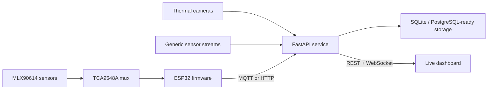

# Predictive Thermal Guard


[](LICENSE)
[](firmware)
[](backend)

An end-to-end ECE/IoT system for detecting thermal faults in electrical
equipment. ESP32 devices collect non-contact temperature measurements,
telemetry enters through MQTT or HTTP, the API persists and analyzes readings,
and the dashboard displays live thermal maps, trends, device health, and
prioritized alerts.

## System



## What is included

- **Device firmware:** ESP32 + MLX90614 + TCA9548A, Wi-Fi reconnection,
  multiplexed sampling, MQTT QoS 1, and HTTP fallback.
- **Generic ingestion:** validated point-temperature payloads from any sensor
  or gateway.
- **Thermal cameras:** rectangular frame ingestion, hotspot localization, and
  frame visualization.
- **Analytics:** adaptive per-sensor baseline, z-score change detection, fixed
  safety thresholds, and warning/critical alerts.
- **API:** FastAPI, OpenAPI, SQLite persistence, device/readings/alerts routes,
  and WebSocket broadcasts.
- **Dashboard:** responsive industrial control-room UI with live/demo modes,
  accessible heat-map inspection, alert details, temperature trends, and
  protocol/device status.
- **Operations:** Docker Compose, Mosquitto, environment configuration,
  telemetry simulator, and CI for all three layers.

## Quick start

### Complete local stack

```bash
cp .env.example .env
docker compose up --build
```

Open:

- Dashboard: `http://localhost:3000`
- API docs: `http://localhost:8000/docs`
- API health: `http://localhost:8000/health`
- MQTT broker: `localhost:1883`

Send realistic demo telemetry:

```bash
python tools/publish_demo.py --api http://localhost:8000
```

### Develop individual layers

```bash
# API
python -m venv .venv
. .venv/bin/activate
pip install -e 'backend[dev]'
uvicorn thermal_guard.main:app --reload

# Dashboard
npm ci
npm run dev

# ESP32
pio run -d firmware
pio run -d firmware -t upload
```

## API examples

Point reading:

```bash
curl -X POST http://localhost:8000/api/v1/readings \
  -H 'content-type: application/json' \
  -d '{"device_id":"panel-a","sensor_id":"L2","temperature_c":78.4}'
```

Thermal frame:

```json
{
  "device_id": "camera-a",
  "camera_id": "mlx90640",
  "width": 2,
  "height": 2,
  "pixels_c": [31.2, 32.0, 78.4, 34.1]
}
```

See [architecture](docs/ARCHITECTURE.md) and
[telemetry protocol](docs/TELEMETRY.md) for integration details.

## Repository layout

```text
app/          Dashboard application
backend/      FastAPI ingestion and analytics service
firmware/     ESP32 PlatformIO project
docs/         Architecture and protocol references
tools/        Local telemetry simulator
.github/      Full-stack CI
```

## License

[MIT](LICENSE) © 2026 Sreeraj Santhosh
