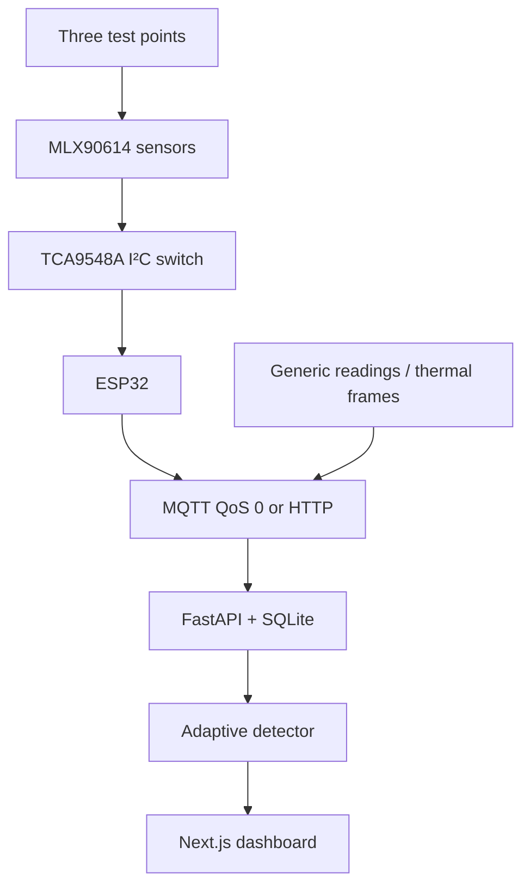

# Predictive Thermal Guard

Predictive Thermal Guard is my ECE project for studying continuous,
non-contact temperature monitoring in a small electrical-panel test rig. The
current prototype measures three points with MLX90614 infrared sensors,
collects the readings on an ESP32, and records them through a Python API.

The name describes the longer-term aim. Version 0.2 detects thermal anomalies;
it does not yet forecast future temperature or remaining useful life.


[](LICENSE)

## Research question

Can a low-cost, fixed infrared sensor node combine equipment-specific limits
and a per-sensor adaptive baseline to detect abnormal heating earlier than an
absolute temperature limit alone?

The repository contains the instrument and the experiment needed to answer
that question. It does not contain a completed calibrated hardware dataset
yet, so the dashboard's demonstration values are not research results.

## Prototype



- The TCA9548A separates three identical-address sensors onto channels 0–2.
- Firmware samples object and ambient temperature once per second.
- MQTT and HTTP use one validated JSON envelope.
- The backend stores readings, device state, alerts, and thermal frames.
- Alerts record whether they came from an absolute limit or the adaptive
  detector.
- The dashboard distinguishes live telemetry from simulated interface data.

The present PubSubClient firmware publishes MQTT at QoS 0. When both transports
are enabled, it attempts both; HTTP is not yet a buffered failover path.

## Detector

For each `(device_id, sensor_id)`, the API maintains an exponentially weighted
mean and variance. After eight warm-up observations, a positive deviation can
raise an adaptive warning. Independent absolute warning and critical limits
are also applied.

Default values are development settings:

| Parameter | Default |
|---|---:|
| Baseline weight, α | 0.05 |
| Adaptive warning score | 3.5 |
| Absolute warning | 70 °C |
| Absolute critical | 85 °C |

These limits are not universal safety limits. They must be justified for the
specific equipment, load, ambient condition, and inspection procedure.

## Build the prototype

### Complete local stack

```bash
cp .env.example .env
docker compose up --build
```

- Dashboard: `http://localhost:3000`
- API documentation: `http://localhost:8000/docs`
- API health: `http://localhost:8000/health`
- MQTT broker: `localhost:1883`

Publish labelled simulated telemetry:

```bash
python tools/publish_demo.py --api http://localhost:8000
```

### Individual layers

```bash
# API
python -m venv .venv
. .venv/bin/activate
pip install -e 'backend[dev]'
uvicorn thermal_guard.main:app --reload

# Dashboard
npm ci
npm run dev

# ESP32
pio run -d firmware
pio run -d firmware -t upload
```

## Reproduce the research

Start with [the experimental method](docs/RESEARCH_METHOD.md). Store raw,
unchanged CSV files under `research/data/raw/`, note every run in
`research/EXPERIMENT_LOG.md`, and use the analysis script:

```bash
python research/analyze_calibration.py research/data/raw/calibration.csv
```

The script reports count, bias, MAE, RMSE, standard deviation, and maximum
absolute error from paired `reference_c` and `sensor_c` columns.

## Current evidence

The software CI verifies the following:

- Ruff lint and strict Mypy checks for the backend;
- backend API and detector tests with coverage reporting;
- dashboard lint, type checking, unit tests, and production build; and
- a PlatformIO firmware build for `esp32dev`.

Software checks do not establish infrared measurement accuracy or fault
detection performance. Those results remain pending until the controlled
experiment is completed. See [results](docs/RESULTS.md).

## Repository map

```text
app/          Next.js research dashboard
backend/      FastAPI ingestion, storage, and detector
firmware/     ESP32 + MLX90614 + TCA9548A firmware
docs/         Architecture, protocol, method, decisions, and results
research/     Experiment log, raw-data convention, and analysis script
tools/        Labelled telemetry simulator
```

## Project limits

- Point sensors only observe the surfaces inside their fields of view.
- Emissivity, reflections, target size, angle, and package heating affect
  infrared readings.
- The adaptive state is currently lost when the API restarts.
- Uptime is not reported until heartbeat history is implemented.
- The prototype has no production authentication or transport encryption.
- An alert identifies unusual heating, not its electrical root cause.

## References

- [Melexis MLX90614 datasheet](https://www.melexis.com/-/media/files/documents/datasheets/mlx90614-datasheet-melexis.pdf)
- [Texas Instruments TCA9548A datasheet](https://www.ti.com/lit/ds/symlink/tca9548a.pdf)
- [NIST EWMA control-chart notes](https://www.itl.nist.gov/div898/handbook/pmc/section3/pmc324.htm)
- [ISO 18434-2 thermography overview](https://www.iso.org/standard/67617.html)

## License

[MIT](LICENSE) © 2026 Sreeraj Santhosh
