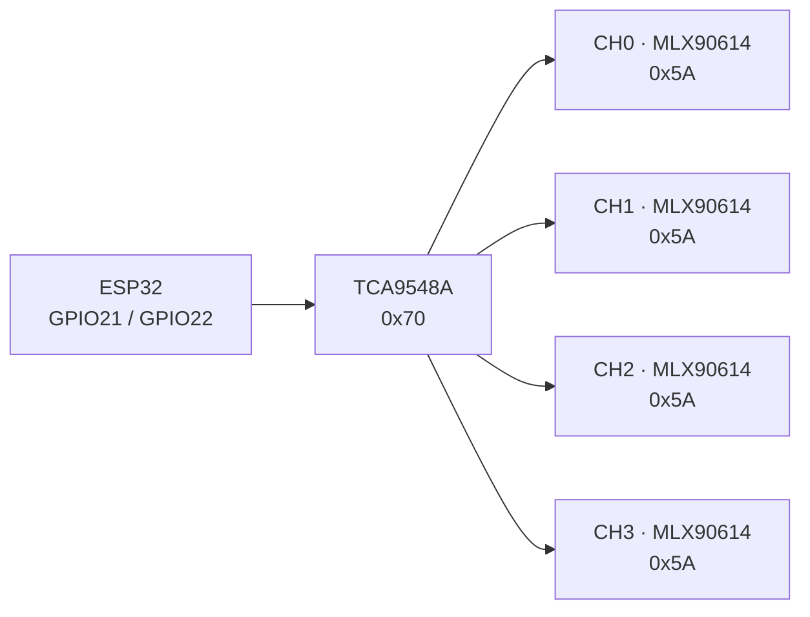

# Wiring

## Host side

| ESP32 | TCA9548A breakout | Note |
|---|---|---|
| 3V3 | VIN | Use 3.3 V logic and power |
| GND | GND | Common reference |
| GPIO21 | SDA | Host I2C data |
| GPIO22 | SCL | Host I2C clock |
| 3V3 through 10 kΩ | RST | Only if the breakout has no reset pull-up |
| GND | A0, A1, A2 | Select mux address `0x70` |

## Sensor side

Repeat this connection for channels 0 through 3:

| TCA9548A | MLX90614 breakout |
|---|---|
| SD0 / SD1 / SD2 / SD3 | SDA |
| SC0 / SC1 / SC2 / SC3 | SCL |
| 3V3 | VIN or VCC, after checking the module |
| GND | GND |

The multiplexer switches only SDA and SCL. Power and ground remain common.

